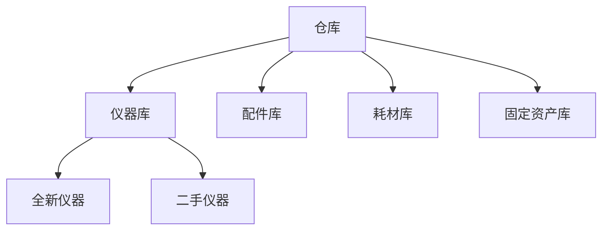

## 仓库管理系统详细说明

### 角色权限设计

#### 工程师权限
- 查询配件、仪器、耗材
- 申请使用物品（可选择绑定/不绑定具体任务）
- 提交采购申请（当仓库没有所需物品时）
- 申请采购（当仓库物品不足时）

#### 系统管理员权限
- 配件、仪器、耗材、固定资产的全部操作权限
- 查询、添加、修改、删除、盘库、出入库
- 统计、报表功能
- 删除物品时需确认删除密码

#### 仓库管理员权限
- 与系统管理员相同的操作权限
- 删除物品时需确认删除密码

#### 客户经理权限
- 查询配件、仪器、耗材
- 查看统计报表
- 提交采购申请
- 申请使用物品

### 物品申请流程
- 申请发送给仓库管理员和系统管理员
- 仓库管理员或系统管理员任一确认即可（不需双重确认）
- 消息页面中需添加相应的申请审批功能

### 仓库结构设计

### 详细字段规范

#### 1. 仪器库字段

##### 1.1 全新仪器（12个必填字段）
- 区域
- 编号
- 设备名称
- 规格型号
- 数量
- 厂家
- 成本
- 生产日期
- 设备描述/备注
- 到货日期

##### 1.2 二手仪器（12个必填字段）
- 区域
- 编号
- 设备名称
- 规格型号
- 数量
- 厂家
- 成本
- 生产日期
- 设备描述/备注
- 回收/购买单位
- 到货日期

#### 2. 配件库字段（8个必填字段，1个可选字段）
- 区域
- 编号
- 货号（可选，非必填）
- 品牌
- 物品名称
- 规格型号
- 数量
- 成本
- 到货日期

#### 3. 耗材库字段（7个必填字段，1个可选字段）
- 区域
- 编号
- 货号（可选，非必填）
- 品牌
- 物品名称
- 规格型号
- 数量
- 成本
- 到货日期

#### 4. 固定资产字段（8个必填字段）
- 区域
- 编号
- 名称
- 规格型号
- 数量
- 厂家
- 成本
- 到货日期
- 描述/备注

### 二维码盘库方案

#### 二维码编码规则
格式：`[仓库代码][库类型][物品ID][校验码]`

- 仓库代码：
  - A：泰州
  - B：苏州
  - C：武汉
  - D：四川

- 库类型：
  - 1：仪器
  - 2：配件
  - 3：耗材
  - 4：固定资产

#### 二维码使用说明
- APP前端不生成二维码，仅提供扫描功能
- 扫描后解析二维码内容，进行盘库、出入库操作
- 扫码入口位于仓库页面右上角
- 仅仓库管理员和系统管理员可以进行扫码操作

### UI设计要点
1. 仓库首页按工作地点（泰州、苏州、武汉、四川）分类显示
2. 支持未来扩展多仓库
3. 仓库删除操作需输入删除密码
4. 每个仓库内分为四个标签页：仪器库、配件库、耗材库、固定资产库
5. 物品管理：
   - 长按物品可进行增删改操作（仅管理员）
   - 删除时需确认删除密码
   - 工程师和客户经理只能查看统计信息和申请使用/采购