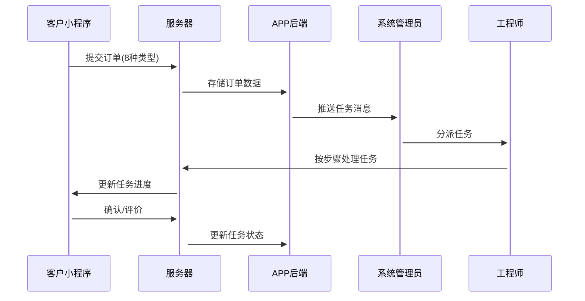

## 项目整体业务流程详细说明

### 数据交互原理

### 订单类型与信息字段

#### 共同信息字段
所有订单类型都包含以下客户信息：
- 姓名
- 公司名
- 部门
- 职位
- 联系电话
- 联系地址
- 联系邮箱

#### 1. 仪器维修
- 仪器名称、类型、品牌、型号
- 故障描述、故障拍照
- 数量

#### 2. 仪器保养
- 仪器名称、类型、品牌、型号
- 故障描述、故障拍照
- 数量

#### 3. 仪器回收
- 仪器名称、类型、品牌、型号
- 数量、附件

#### 4. 仪器租赁
- 仪器名称、类型、品牌、型号
- 数量、附件

#### 5. 培训预约
- 仪器名称、类型、品牌、型号
- 预约时间

#### 6. 仪器验证
- 仪器名称、类型、品牌、型号
- 验证类别（IQ安装验证、OQ运行验证、PQ性能验证）
- 附图、数量

#### 7. 仪器选型
- 仪器用途或者名称
- 需求描述
- 需求数量

#### 8. 仪器安装
- 仪器名称、类型、品牌、型号
- 拍照、数量

### 通用任务处理流程

所有8种任务类型都遵循以下基本流程步骤：

1. **已接单**
   - 系统通知客户保持电话畅通
   - 工程师电话联系客户确认情况

2. **判断是否需要上门**
   - 分支选择：需要上门/不需要上门
   - 需要上门：约定上门时间，继续常规流程
   - 不需要上门：直接跳转至服务评价步骤

3. **检查/评估完成**
   - 工程师提交评估结果（文字+图片）
   - 系统通知客户等待方案和报价

4. **方案和报价**
   - 提供评估结果（文字+图片）
   - 提供服务方案（文字+图片，可选）
   - 提供服务报价
   - 客户可确认订单

5. **服务进行中**
   - 显示工程师正在服务中
   - 工程师可更新进度和上传资料

6. **验证报告**
   - 工程师提交验证报告
   - 客户确认验证报告

7. **服务评价**
   - 服务态度评分（星级）
   - 服务质量评分（星级）
   - 总体评价评分（星级）

8. **订单已完成**
   - 系统标记任务完成
   - 向客户显示完成信息

### 关键业务节点

#### 上门判断分支点
- 位于流程第2步
- 工程师判断是否需要上门服务
- 选择不上门时跳过中间步骤，直接进入评价环节
- 选择上门时按正常流程进行

#### 方案/报价确认点
- 位于流程第4步
- 客户需确认方案和报价
- 确认后工程师才能继续后续步骤
- 未确认状态下任务处于"客户确认中"状态

#### 服务评价终结点
- 位于流程第7步
- 客户完成评价后任务自动完成
- 评价数据用于后续服务质量分析

### 异常处理流程

#### 超时未接单
- 系统自动检测任务分派后的接单时间
- 超过预设时间未接单，系统自动提醒管理员
- 管理员可重新分派任务

#### 协助请求被拒
- 系统记录拒绝原因
- 通知发起协助请求的工程师
- 工程师可选择其他人员或自行处理

#### 任务转出处理
- 记录转出原因
- 新接收人可接受或拒绝
- 拒绝时需提供理由
- 原任务所有者和系统管理员收到通知