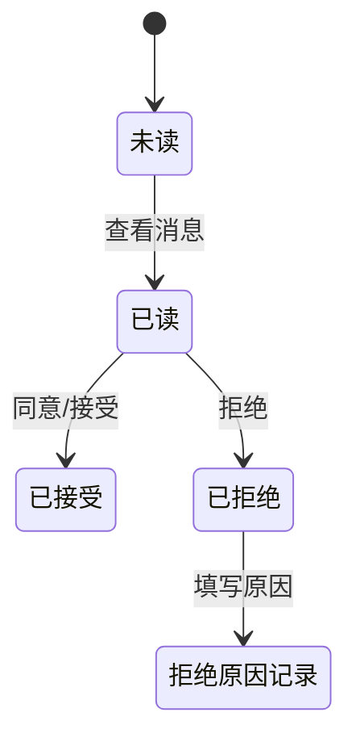

## 消息通知系统详细说明

### 消息类型与功能

#### 1. 公告消息
- **发送权限**：仅系统管理员可发送
- **接收范围**：所有角色都可接收
- **操作入口**：右上角"发送公告"按钮
- **内容格式**：支持文字、图片、附件

#### 2. 任务分发消息
- **数据流向**：小程序→服务器→系统管理员→工程师
- **处理流程**：
  1. 客户通过小程序上传任务数据
  2. 数据存入未分发任务表（与客户绑定）
  3. 后端自动将任务以消息形式发送给系统管理员
  4. 系统管理员查看消息详情（显示任务简略信息和客户信息）
  5. 系统管理员选择将任务派发给工程师跟进

#### 3. 协助请求消息
- **发起方**：任务所有者工程师
- **接收方**：被邀请协助的工程师
- **处理选项**：
  - 接受协助请求
  - 拒绝协助请求（必须填写拒绝原因）
- **管理功能**：系统管理员可查看协助请求的处理详情

#### 4. 转出任务消息
- **发起方**：任务所有者工程师或系统管理员
- **接收方**：被转出任务的工程师（可单个或多个）
- **必要信息**：消息详情需附上转出原因
- **处理选项**：
  - 接受任务转出
  - 拒绝任务转出（需填写意见）

#### 5. 聊天消息
- **使用范围**：仅APP使用者间沟通，不涉及客户
- **功能特点**：
  - 类似微信聊天界面
  - 支持图片、附件、文字发送
  - 不支持表情包
- **应用场景**：公司内部沟通

### 消息状态流转

### 特殊消息处理机制

#### 仓库申请消息
- **审批机制**：双通道确认
  - 发送给仓库管理员和系统管理员
  - 任一角色确认即可通过（非双重审批）
- **申请类型**：
  - 物品使用申请
  - 物品采购申请

#### 消息设置
- 沿用现有的消息设置界面
- 可配置消息提醒方式
- 可设置消息分类显示

### 实现要点
1. **消息持久化**：所有消息需持久化存储，支持历史查询
2. **消息状态同步**：消息状态变更需实时同步到所有相关用户
3. **未读消息提醒**：未读消息需有明显标识和提醒
4. **消息分类展示**：按消息类型分类展示
5. **消息搜索功能**：支持按关键词、发送人、时间等条件搜索消息